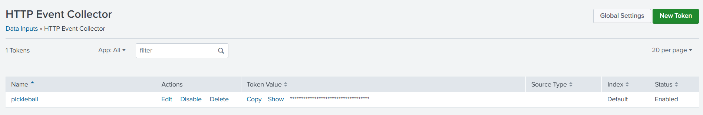
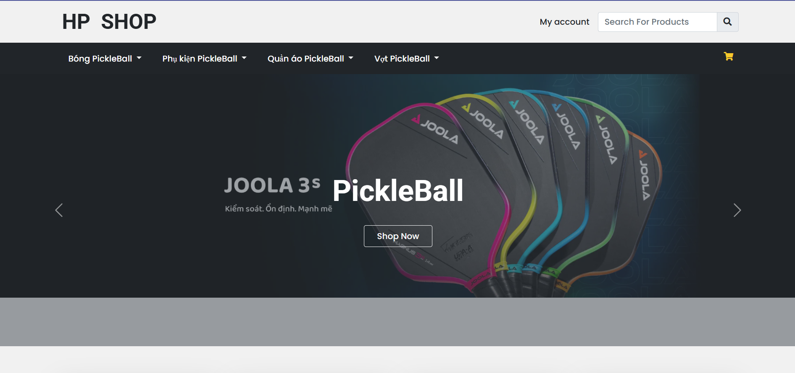
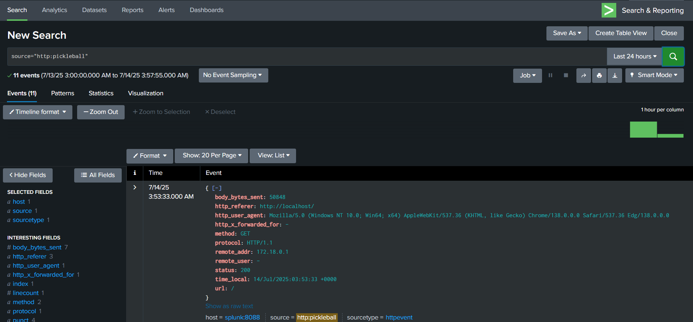

# Logging service with Splunk

## 🔗 Link source: https://github.com/phucnguyen210/PickleBall-Shop

## ✅ Features from the Original Source
The original project provides a basic e-commerce website tailored for the Pickleball domain, with the following core features:
- Frontend interface with product listings, product detail pages, and shopping cart.
- User registration and login functionality.
- Order management for users (view and track orders).
- Admin dashboard:
  - Product management (CRUD operations)
  - User and order management
- Role-based access control between admin and customer
- Simple payment integration
- Built with Laravel and Blade Template
- Styled with Bootstrap CSS
## 🛠  What I really did
This customized version extends the original project by:
- Dockerizing the entire application using Docker Compose (Laravel, Nginx, PHP-FPM, MySQL)
- Adding Fluent Bit for log collection from Nginx
- Forwarding logs to Splunk via HEC for monitoring and analysis
- Organizing logging configuration for easier debugging and observability
- Minor refinements to environment setup and configuration for local development


### 1. Create `Dockerfile`

```bash
  RUN apt-get update && apt-get install -y \
      git curl zip unzip libpng-dev libonig-dev libxml2-dev libzip-dev \
      && docker-php-ext-install pdo_mysql mbstring zip exif pcntl bcmath gd
  COPY --from=composer:latest /usr/bin/composer /usr/bin/composer
  WORKDIR /var/www
  COPY ./src /var/www
  RUN composer install --no-dev --optimize-autoloader
  RUN php artisan config:clear && \
      php artisan route:clear && \
      php artisan view:clear && \
      php artisan key:generate && \
      php artisan config:cache && \
      chown -R www-data:www-data /var/www && \
      chmod -R 775 /var/www/storage /var/www/bootstrap/cache
```
### 2. Create nginx configuration in `docker/nginx/nginx.conf`
I used Nginx as a reverse proxy to serve the application and forward `.php` requests to the app container.
```
server {
    listen 80;
    location / {
        try_files $uri $uri/ /index.php?$query_string;
    }
    location ~ \.php$ {
        include fastcgi_params;
        fastcgi_pass pickleball-http;
        fastcgi_index index.php;
        fastcgi_param SCRIPT_FILENAME $realpath_root$fastcgi_script_name;
    }
}
```
### 3. Create HEC token in Splunk
Go to `Setting` --> `Data Input` --> `HTTP Event Collector` and create/copy the generated token.

### 4. Configure fluentbit to collect logs from Nginx
In `docker-compose.yml`, bind mount Nginx logs to host dir `./nginx/logs:/var/log/nginx`. \
Fluentbit will collect access logs and error logs from `/var/log/nginx/` and forward log to Splunk.
### 5. Create `docker-compose.yml` and copy environtment from `src/`
```
  services:
    pickleball-shop:
    nginx:
    fluentbit:
    database:
  volumes:
    db_data:
  networks:
    app:
```
### 6. Deploy all services
Run `docker compose up -d` to start up all services. \
Wait for all services ready. Access to `localhost:80`. If you see a "MySQL connection refused" error,, use this command to clear cache config: \
`docker exec -it pickleball-shop php artisan config:cache` \
`docker exec -it pickleball-shop php artisan config:cache` \
Our website is online !!!🎉🎉🎉

### 7. Finally, go to Splunk and  check
All Nginx logs are now forwarded to Splunk. You can now enjoy Splunk's powerful log search and filtering features!

